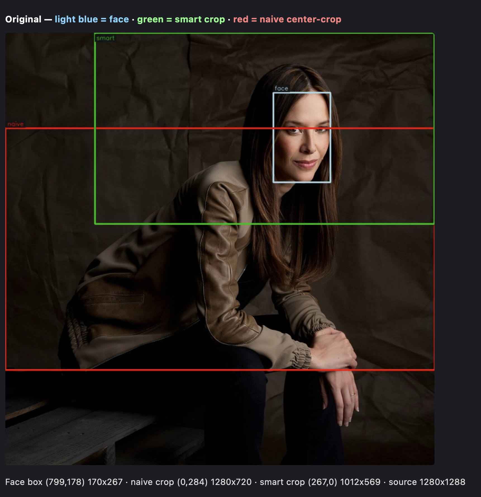

# Reframe

Face-aware image cropping for Wikimedia Commons, exposed as a **URL you can use
like a thumbnail**.

Try it: (https://reframe.toolforge.org)

Given a Commons file name and a target window (landscape, square, portrait),
this crops the image so the **face stays visible and well-composed** — instead
of the naive center-crop that lands on the torso.

```
https://reframe.toolforge.org/crop?file=File:Name.jpg&width=300&height=200&gravity=face
```

It's a miniature ["thumbor"](https://github.com/thumbor/thumbor) for Commons:
a tiny face detector + ~30 lines of crop geometry, no GPU, no ML serving stack.

Tightness: the face-aware crop sizes itself so the head region fills a
configurable fraction of the crop height (`tightness`, default 0.55).
Lower (0.3) = looser, more of the subject/scene visible; higher (0.9) = tight
headshot. Face-aware only; naive center crops are unaffected.

A "compare" mode can interactively show you the results based on your parameters.
* [Click for the compare dashboard.](https://reframe.toolforge.org/compare?file=File%3A2022-02-27+Leichtathletik%2C+Deutsche+Hallenmeisterschaften+1DX+5389+by+Stepro.jpg&aspect=3%3A4&tightness=0.45&eyeline=0.25&gravity=auto)



## What's inside

| File | Purpose |
|------|---------|
| `smartcrop.py` | Core library: face detection + crop geometry + a CLI |
| `proxy.py` | Flask web service — `/crop` API + `/compare` interactive page |
| `compare.py` | Side-by-side naive-vs-smart comparison montage (CLI dev tool) |
| `compare_web.py` | Image compositing for the `/compare` page |
| `models/` | YuNet face-detection ONNX model (~230 KB) |

## Quickstart (local)

```bash
python3 -m venv venv && source venv/bin/activate
pip install -r requirements.txt

# CLI: crop a local image to 16:9 (default tightness 0.55), annotated debug output
python smartcrop.py photo.jpg --aspect 16:9 --draw
# tight headshot: head fills 90% of the crop height
python smartcrop.py photo.jpg --size 640x360 --tightness 0.9

# Proxy: serve the crop URL locally
python proxy.py
# then open:
#   http://localhost:8765/crop?file=File:Barack_Obama_family_portrait_2011.jpg&width=300&height=200&gravity=face
```

## Proxy API

`GET /crop?file=...&...` — returns the cropped JPEG

| Param | Required | Description |
|-------|:--------:|-------------|
| `file` | ✅ | Commons file name — see [File name formats](#file-name-formats) below |
| `width` / `height` | either | Exact output size in px. Crops to that aspect, then scales. |
| `aspect` | either | Target ratio instead of exact size, e.g. `16:9`, `1:1`, `9:16` |
| `gravity` | no | `face` (default), `center`, or `auto` (face if found, else center) |
| `tightness` | no | How tight the crop hugs the face: fraction of crop height filled by the head region, `0` (loose) – `1` (face-filling). Default `0.55`. Face-aware only. Zooms **around the eye line** — placement stays put. |
| `eyeline` | no | Where the eye line sits in the crop: fraction of frame height from the top, `0.1` – `0.9`. Default `0.39` (≈ the old hardcoded 13% headroom); `0.30` = classic portrait placement (eyes a third of the way down). Face-aware only. |

Defaults to a **square** crop if no size/aspect is given.

`GET /css?file=...&...` — **CSS mode**: no pixels served. Same pipeline
(fetch, detect, geometry), but the response is JSON with the CSS properties
that reproduce the crop client-side:

```json
{
  "file": "File:Jade_Raymond_Feb_2012-cropped.jpg",
  "aspect": "1:1",
  "gravity": "face",
  "tightness": 0.85,
  "eyeline": 0.39,
  "face_detected": true,
  "object_fit": "cover",
  "object_position": "81.2% 0.0%",
  "css": "object-fit: cover; object-position: 81.2% 0.0%;",
  "matches_exact": false,
  "cover_window": {"w": 1280, "h": 1280},
  "css_exact": "background-size: 255.0% 256.6%; background-position: 81.2% 0.0%;",
  "zoom": {"x": "255.0%", "y": "256.6%"},
  "background_css": "background-size: cover; background-position: 81.2% 0.0%;",
  "crop_needed": true,
  "crop_rect": {"x": 632, "y": 0, "w": 502, "h": 502},
  "source": {"url": "https://commons.wikimedia.org/wiki/Special:FilePath/...",
             "width": 1280, "height": 1288, "note": "..."},
  "example": "<div style=\"width: 300px; height: 300px; ...\"></div>"
}
```

Same params as `/crop` (`file`, `width`/`height` or `aspect`, `gravity`,
`tightness`), same headers (`Cache-Control`, `X-SmartCrop-Face`), same error
semantics (400/404/502/415). The client loads `source.url` itself and applies
the style to any box of the target aspect:

```html
<!-- simple: object-fit (no zoom) -->
" style="width: 300px; height: 300px; object-fit: cover; object-position: 81.2% 0.0%;">
<!-- exact: background-size zoom — matches /crop -->
<div style="width: 300px; height: 300px; background: url(<source.url>) no-repeat; background-size: 255.0% 256.6%; background-position: 81.2% 0.0%;"></div>
```

**Why it works:** under `object-fit: cover`, the visible window's left edge
sits at `(img_w − crop_w) × p/100` source pixels when `object-position: p%` —
so `p = crop_x / (img_w − crop_w) × 100` positions the window (same for the
vertical axis). The percentages are **size-invariant**: they hold for *any*
thumbnail size of the same image.

**The zoom caveat (why the two examples differ):** `/crop` picks a crop window
and **scales it up** to fill the output. Plain `object-fit: cover` **cannot
zoom** — it only ever shows the *largest* window of the target aspect that
fits the image (`cover_window` in the response), and `object-position` merely
slides it. So when the crop is tighter than the cover window (typical for
tightness ≥ 0.55, and extreme for near-square images), the object-fit variant
shows a wider, looser framing — the face stays in frame but doesn't match
`/crop`. `matches_exact: true` means they coincide.

The **exact recipe** is `css_exact`: `background-size: iw/w*100% ih/h*100%`
zooms the image against the box arbitrarily, and `background-position: p% q%`
slides the window with the same alignment semantics — so it reproduces the
`/crop` framing exactly at any box size of the target aspect (verified
pixel-identical in a real browser, MAE ~1–2/255).

### File name formats

`file` (on both `/crop` and `/compare`) accepts any of:
`File:Khagdaev 02.jpg` · `File:Khagdaev_02.jpg` · `Khagdaev 02.jpg` ·
`Khagdaev_02.jpg` · `https://commons.wikimedia.org/wiki/File:Khagdaev_02.jpg` —
it is normalized to the canonical `File:` title (spaces/underscores are
equivalent in MediaWiki titles).

### Compare page

`GET /compare?file=File:Name.jpg&aspect=1:1&tightness=0.55&gravity=face` — an interactive HTML page
that shows, for any Commons file: the original annotated with the face box
(light blue), the smart crop (green) and the naive center-crop (red), plus
the dedicated naive and smart crops side by side, and ready-to-use
`/crop` and `/css` API URLs matching the selected aspect, gravity and
tightness — the `/css` card also shows the object-position and a live
preview of the image reframed entirely client-side. Aspect selector: 16:9 · 3:2 ·
4:3 · 1:1 · 3:4 · 2:3 · 9:16, tightness (0.30–0.90) and eyeline (0.10–0.70)
sliders, and gravity radio buttons (face / auto / center) so the differences
are visible side by side. `file` is optional — omit it to get the empty form
(useful as a standalone tool page). The API URL card reflects the chosen
gravity, tightness and eyeline.

Response headers:
- `Cache-Control: public, max-age=604800, immutable` — output is deterministic,
  so cache aggressively.
- `X-SmartCrop-Face: yes|no` — whether a face was detected and used.

Errors (plain-text body, proper status):
- `400` — missing/invalid parameter (`file`, `aspect`, `gravity`, `tightness`)
- `404` — the file doesn't exist on Commons
- `502` — Commons unreachable or fetch failed
- `415` — fetched bytes aren't a decodable image

## How it works

1. **Fetch** — resolves the `File:` title via
   [`Special:FilePath?width=1200`](https://commons.wikimedia.org/wiki/Special:FilePath),
   so Commons handles format conversion for free (SVG→PNG, PDF→JPEG, video
   keyframe) and we get a bounded-size raster to work with. Fetches are
   disk-cached by canonical title (7 days; 404s negative-cached for 10 min) —
   see [Production notes](#production-notes).
2. **Detect** — [YuNet](https://github.com/opencv/opencv_zoo/tree/main/models/face_detection_yunet)
   returns a face bounding box (~30 ms CPU). Falls back to OpenCV's bundled
   Haar cascade if the ONNX model is missing.
3. **Crop** — the geometry (the actual "smart" part):
   - expand the face box upward for hair/headroom, downward for neck/shoulders
   - place the (estimated) eye line at `eyeline` of the crop height: `0.39`
     default (≈ the old 13% headroom constant), `0.30` = classic portrait
     eyes-a-third-down; tightness zooms *around* the eye line, so zooming no
     longer shifts the eyes in the frame
   - center horizontally on the face, clamp to image bounds
   - largest face wins in group shots; no face → center-crop fallback
4. **Serve** — `/crop` encodes the crop as JPEG; `/css` converts the same crop
   rect into `object-position` percentages (see [CSS mode](#css-mode-1) —
   CLI: `python smartcrop.py photo.jpg --aspect 16:9 --css`).

## Detector options (all local, no GPU)

| Detector | Size | Dependency | WIDER FACE hard AP | Notes |
|----------|------|-------------|--------------------|-------|
| **YuNet** | 230 KB | `opencv-python-headless` | 75.0 | ✅ default; ships in `models/`; ~1.6 ms @ 320² on CPU |
| Haar cascade | 0 KB | `opencv-python-headless` | — | zero-download fallback; misses profile/tilted faces |
| MediaPipe BlazeFace | 0.2–1.1 MB | `mediapipe` | n/a¹ | mobile-tuned; good on profile/tilted close-ups |
| SCRFD-500M | 2.5 MB | none (`cv2.dnn`) | 68.5 | smallest SCRFD; better easy/medium, worse hard than YuNet |
| **SCRFD-2.5G** | 3.3 MB | none (`cv2.dnn`) | **77.1** | **best accuracy/speed balance**; official ONNX export |
| SCRFD-10G | 17 MB | none (`cv2.dnn`) | 82.8 | accuracy-first; heavy CPU cost |
| RetinaFace (ResNet-50) | ~100+ MB | `onnxruntime` | 91.4² | strongest classic detector; too slow for a thumbnail API |

¹ BlazeFace reports Google-internal smartphone-camera recall (~99%), not
WIDER FACE — not comparable.
² RetinaFace paper's top configuration; MobileNet variants are much lighter
but score substantially lower.

Benchmark caveat: hard-set AP figures come from each model's own paper/docs
(single-scale), so they're directional, not apples-to-apples. For this
service's actual job — find the **single largest face** in a Commons portrait —
the practical ladder is:

- **Default (today): YuNet** — tiny, ~1.6 ms, zero new deps, and Commons
  portraits are mostly frontal. 75.0 hard AP is plenty for
  largest-face-wins.
- **If profile/tilted or small faces matter: SCRFD-2.5G** — 77.1 hard AP at
  ~3 MB, loads via `cv2.dnn.readNetFromONNX()` with **no new pip dependency**
  (same cached-detector pattern as YuNet).
- **Max accuracy: SCRFD-10G** (82.8) or RetinaFace (91.4) — only if a
  deployment can afford 100+ ms CPU per request; overkill for a thumbnail
  service.
- **MediaPipe BlazeFace** — the choice only if you want the `mediapipe`
  package's extras (landmarks, face mesh). As a pure detector it's
  mobile-tuned and less robust on small/occluded faces than SCRFD.

### Swapping the detector

All detectors plug into `detect_face()` in `smartcrop.py` — the crop geometry
is unchanged. YuNet loads through `cv2.FaceDetectorYN`; SCRFD/RetinaFace ONNX
exports load through `cv2.dnn.readNetFromONNX` (or `onnxruntime` for higher
throughput); BlazeFace needs the `mediapipe` pip package. Whatever the
backend, keep the cached-singleton pattern (lazy-load once per process,
guard with a lock — the YuNet detector is not thread-safe) and return a
single `(x, y, w, h)` box for the largest face: the geometry layer doesn't
care where the box came from.

## Deploying to Toolforge

This is community infrastructure: an OSI license is required (MIT included).
The planned tool name is `reframe` (`reframe.toolforge.org`) — verified
available (no tool by that name is currently running). The repo directory can
stay `commons-smartcrop`; only the tool name matters for the domain.

### Option A — Build Service (recommended)

The build service accepts **any public Git repo** — GitHub, GitLab, or Gerrit.
(Deployed 2026-08-14 from `https://github.com/fuzheado/reframe`.)

```bash
# create the tool at https://toolsadmin.wikimedia.org/tools/create
# create a repo for it, then:
git push   # a Procfile + .python-version are already in this repo

ssh <user>@login.toolforge.org
become <tool>
toolforge build start https://gitlab.wikimedia.org/toolforge-repos/<tool>.git
toolforge build show              # wait for "Succeeded"
toolforge webservice buildservice start --mount=none
```

### Option B — Traditional (scp + venv)

```bash
scp -r . <user>@login.toolforge.org:/data/project/<tool>/
ssh <user>@login.toolforge.org
become <tool>
python3 -m venv venv && source venv/bin/activate
pip install -r requirements.txt
webservice --backend=kubernetes python3.11 start
```

Then hit `https://<tool>.toolforge.org/crop?file=...&width=...&height=...`.

### Production notes

- **Rate limiting & caching (added 2026-08-15):** the proxy has an upstream
  disk cache (`cache.py`), a per-IP rate limiter (`ratelimit.py`), and fetch
  guards, all tunable via env vars (Toolforge:
  `toolforge envvars set KEY=value`):

  | Env var | Default | Meaning |
  |---------|---------|---------|
  | `CACHE_DIR` | `./cache` | Disk cache location. Pod-local — deploy uses `--mount=none`, so it resets on redeploy; fine, CPU is cheap, the cache's job is collapsing duplicate fetches within a deployment |
  | `CACHE_MAX_BYTES` | 2 GiB | Evict-oldest cap for the cache dir |
  | `CACHE_TTL` | 604800 (7 d) | TTL for fetched images |
  | `CACHE_TTL_NOT_FOUND` | 600 (10 min) | Negative-cache TTL for 404s — blocks nonexistent-file hammering |
  | `RATE_LIMIT` | 120 | Fixed-window limit per client IP per minute. **Per worker**: with 2 sync workers the effective cap is 2× — deliberate; a soft guard, the cache does the real abuse work |
  | `FETCH_MAX_BYTES` | 20 MiB | Abort upstream fetches larger than this (bounds memory) |
  | `FETCH_CONCURRENCY` | 4 | Max simultaneous Commons fetches per process (semaphore) |

  Rate-limited responses are 429 with `Retry-After` (never `Cache-Control:
  immutable`). Every request logs `METHOD path -> status (cache hit|miss,
  ms, ip)` — that's how you watch hit rate.
- `gunicorn` sync workers are recommended (one request per worker at a time)
  because the cached YuNet detector is not thread-safe. The `Procfile` uses
  `--workers=2`. Don't raise it blindly: each sync worker is a separate
  process holding OpenCV + numpy + YuNet (~100–150 MB RSS), and the
  buildservice pod's default 512 Mi limit OOM-killed the container at
  `--workers=4` (symptom: intermittent `upstream connect error … reset
  reason: connection termination` from the ingress). Start the webservice
  with `-m 1Gi` for headroom: `toolforge webservice buildservice start
  --mount=none -m 1Gi`.
- Pin exact dependency versions (`pip freeze > requirements.txt`) for
  reproducible Toolforge deploys.
- `opencv-python-headless` is pinned to `<5`: OpenCV 5.x removed
  `cv2.CascadeClassifier` and no longer ships the Haar cascade XMLs, which
  breaks the no-face fallback path. 4.x has wheels for Python 3.11 (Toolforge)
  and 3.14.
- The proxy sends a descriptive User-Agent: `$WIKIMEDIA_USER_AGENT` if set
  (already configured on this machine with `andrew.lih@gmail.com` contact),
  else a built-in fallback with the same contact info. Required by Wikimedia
  API etiquette.

## License

MIT. The YuNet model in `models/` is from
[opencv/opencv_zoo](https://github.com/opencv/opencv_zoo) (Apache-2.0) — see
`models/README.md`.
